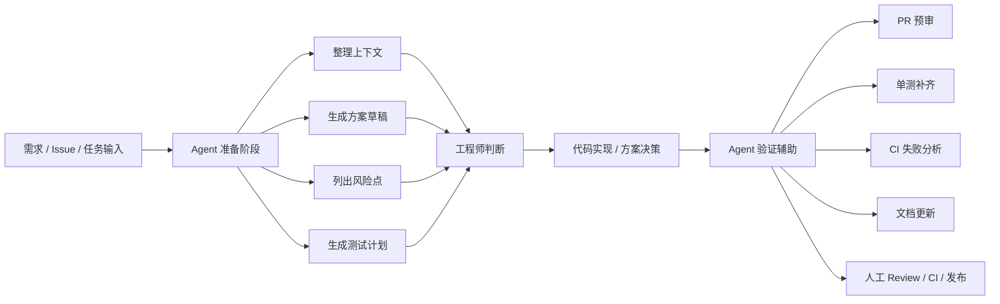
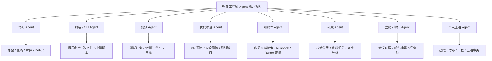
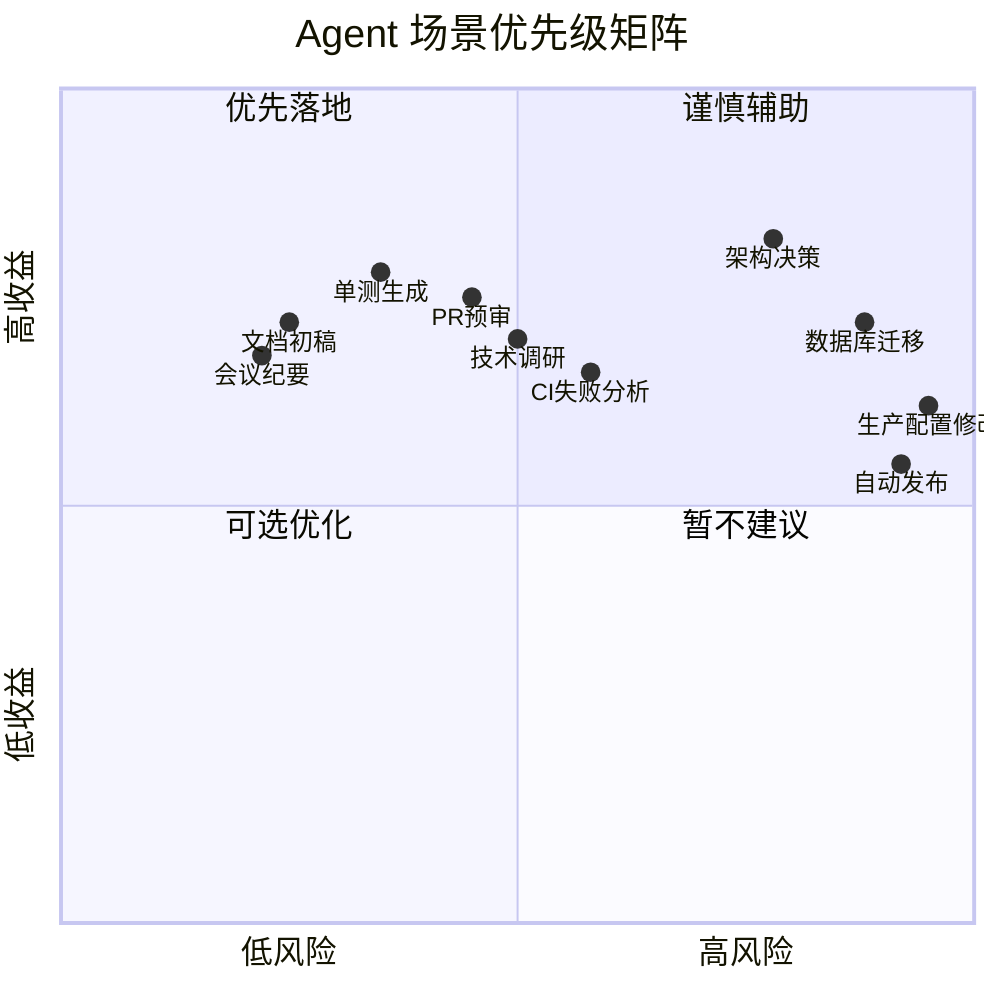
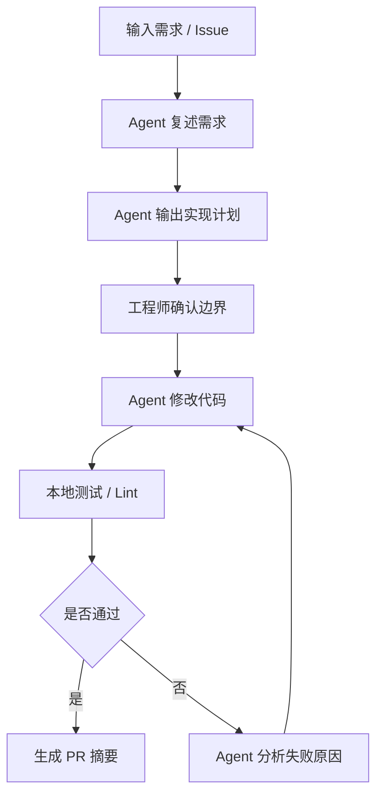
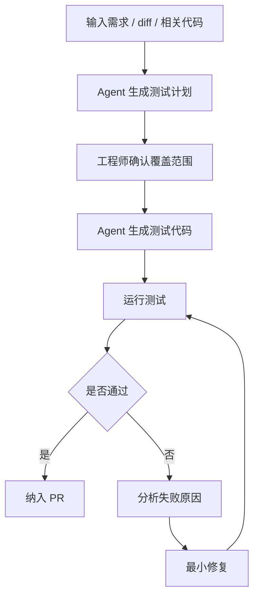
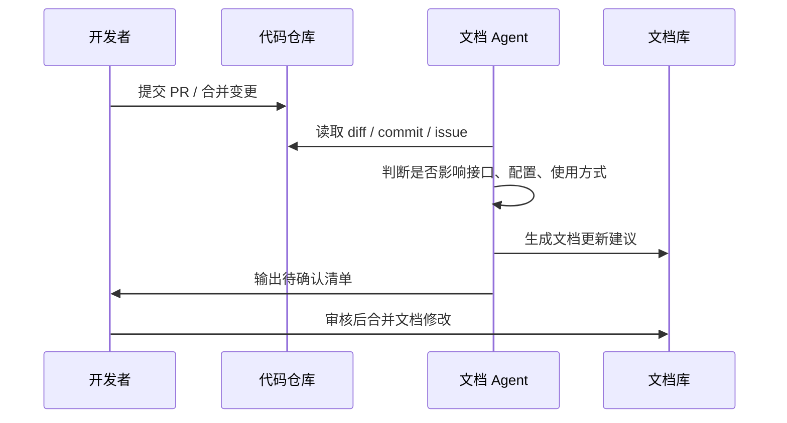
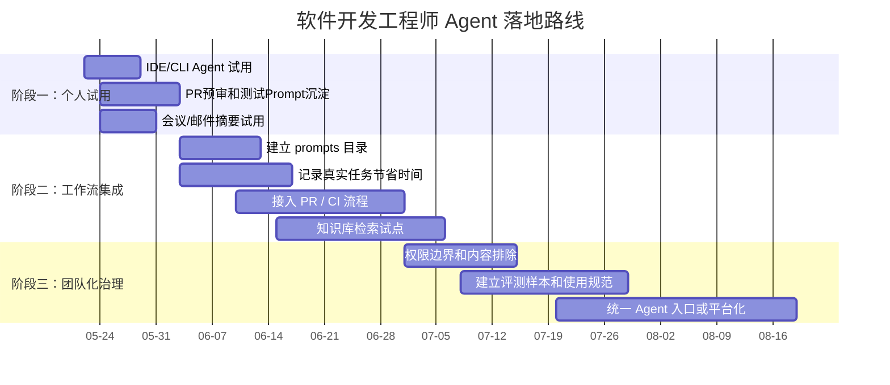

# 软件开发工程师 Agent 提效调研报告

## 1. 执行摘要

### 1.1 核心结论

Agent 对软件开发工程师的价值，不应只理解为“帮我写代码”。从实际工作流看，它更适合优化以下几类高频场景：

1. **降低上下文切换成本**：会议、邮件、Issue、文档、代码仓库、CI 日志之间频繁切换，是工程师效率损失的重要来源。
2. **处理重复性工程任务**：样板代码、单测草稿、PR 摘要、变更说明、README 更新、脚本生成等任务边界清晰，适合 Agent 介入。
3. **增强第一轮分析能力**：Debug 初步归因、CI 失败分析、PR 预审、技术调研资料收敛，都可以由 Agent 先完成初筛。
4. **改善知识获取效率**：公司内部文档、历史 ADR、Runbook、Issue 记录、API 文档分散在多个系统中，Agent 可以作为知识检索和总结层。
5. **辅助个人事务管理**：日程、提醒、待办、邮件摘要、账单和生活安排可以交给轻量级个人 Agent 处理，减少碎片化干扰。

调研建议：**优先把 Agent 用在“高频、低风险、结果可验证”的任务上；对架构决策、核心业务逻辑、生产变更、权限和数据迁移等高风险任务，Agent 只应辅助分析，不能自主决策。**

---

## 2. 调研背景与目标

### 2.1 背景

软件开发工程师的日常工作已经不只是编码。实际工作通常包括：需求理解、方案设计、代码实现、Debug、测试、Review、文档、上线、排障、会议沟通、知识沉淀和个人任务管理。

其中大量任务具备三个特征：

- **高频**：几乎每天都会发生；
- **重复**：流程和输入输出相对稳定；
- **可验证**：可以通过测试、CI、人工 Review、文档比对等方式校验结果。

这些任务正是 Agent 最适合切入的区域。

### 2.2 调研目标

本报告目标是回答三个问题：

1. 软件开发工程师的日常工作和生活中，哪些环节适合使用 Agent 提效？
2. 不同类型 Agent 应该如何匹配具体场景？
3. 个人或团队应如何分阶段落地，避免工具泛滥和风险失控？

### 2.3 适用范围

本报告适用于以下对象：

- 后端、前端、全栈、客户端、平台工程、测试开发等软件工程师；
- 希望用 Agent 提升个人效率的开发者；
- 希望在团队内试点 AI 工程化流程的技术负责人；
- 正在评估 Copilot、Cursor、Codex、Claude Code、Gemini Code Assist、Amazon Q、Rovo、Notion AI、Microsoft 365 Copilot 等工具的工程团队。

---

## 3. 软件工程师任务地图

### 3.1 日常任务分类

| 类别 | 典型任务 | 当前痛点 | Agent 可优化方向 |
|---|---|---|---|
| 编码实现 | 新功能、重构、修 Bug、脚本编写 | 样板代码多，跨文件修改繁琐 | 代码生成、批量修改、解释代码、生成实现计划 |
| Debug 排障 | 看日志、复现问题、定位根因 | 信息分散，排查路径不清晰 | 日志摘要、根因假设排序、验证步骤生成 |
| 代码审查 | PR Review、规范检查、安全检查 | 第一轮机械检查耗时 | PR 预审、风险提示、测试缺口识别 |
| 测试 | 单测、集成测试、E2E、回归 | 测试设计和维护成本高 | 测试计划、测试代码草稿、失败分析 |
| 技术方案 | 选型、ADR、架构设计 | 资料分散，方案对比耗时 | 资料收敛、对比表、风险清单 |
| 文档 | README、接口文档、变更说明 | 文档滞后，没人愿意写 | 文档初稿、Release Notes、接口说明 |
| 知识检索 | 查历史 Issue、Runbook、Owner | 知识分散，搜索效率低 | 企业搜索、RAG、跨系统问答 |
| 协作沟通 | 会议、邮件、周报、IM | 打断多，信息容易丢失 | 会议纪要、邮件摘要、行动项提取 |
| 个人生活 | 日程、提醒、账单、出行、购物 | 零碎但消耗注意力 | 自动提醒、待办整理、摘要和计划 |

### 3.2 Agent 在工程流程中的位置



关键判断：**Agent 最适合放在准备阶段和验证阶段，而不是直接接管最终决策。**

---

## 4. Agent 能力类型与适用场景

### 4.1 Agent 能力版图



### 4.2 工具类型与代表产品

| Agent 类型 | 代表工具 | 更适合的场景 | 注意事项 |
|---|---|---|---|
| IDE 编码 Agent | GitHub Copilot、Cursor、JetBrains AI、Gemini Code Assist | 日常编码、代码解释、重构、单测草稿 | 依赖仓库上下文质量，不能盲信生成代码 |
| CLI / 终端 Agent | Claude Code、Codex CLI、Gemini CLI、Amazon Q CLI | 批量脚本、跨文件修改、本地任务自动化 | 必须限制写权限，避免误删和误改 |
| 仓库 Agent | GitHub Copilot coding agent、GitLab Duo | Issue 实现、PR 预审、CI 分析、文档同步 | 必须走分支、PR、CI 和人工 Review |
| 测试 Agent | Playwright Test Agents、mabl | E2E 测试生成、自愈、回归补齐 | 页面可测试性和环境稳定性是前提 |
| 企业知识 Agent | Atlassian Rovo、Notion AI、Azure AI Search、OpenAI File Search | 内部知识检索、文档问答、Runbook 查询 | 权限继承和数据边界非常关键 |
| 研究 Agent | ChatGPT Deep Research、Gemini Deep Research、Notion Research Mode | 技术调研、竞品分析、方案对比 | 必须要求引用来源，避免过期信息 |
| 办公 Agent | Microsoft 365 Copilot、Gemini for Workspace、Notion AI Meeting Notes | 邮件、会议、日程、周报 | 注意会议隐私和组织授权 |
| 个人助理 Agent | ChatGPT Tasks、Gemini Connected Apps、Apple Intelligence | 提醒、待办、摘要、个人计划 | 不适合处理高风险财务或隐私操作 |

---

## 5. 场景价值评估

### 5.1 优先级判断模型

建议从两个维度判断一个 Agent 场景是否值得落地：

- **收益**：是否显著减少时间消耗、重复劳动或上下文切换；
- **风险**：如果 Agent 出错，是否会造成线上事故、数据泄露、错误决策或客户影响。



### 5.2 推荐优先级

| 优先级 | 场景 | 推荐动作 | 原因 |
|---|---|---|---|
| P0 | PR 前自查 | 建固定 Prompt，提交前自动检查 | 高频、低风险、结果可人工确认 |
| P0 | 单测补齐 | 先生成测试计划，再生成测试代码 | 边界清晰，收益稳定 |
| P0 | 会议纪要 / 邮件摘要 | 自动提取结论和行动项 | 减少沟通遗漏和上下文切换 |
| P1 | CI 失败分析 | 汇总日志，输出根因假设和验证步骤 | 能缩短排障启动时间 |
| P1 | 技术调研 | 输出方案对比表和风险清单 | 适合资料收敛，不适合直接决策 |
| P1 | 文档更新 | 根据 PR / diff 生成变更说明 | 解决文档滞后问题 |
| P2 | E2E 自动生成和自愈 | 在测试体系较成熟后接入 | 收益高，但依赖环境和规范 |
| P2 | 企业知识库问答 | 接入文档、Issue、Runbook | 对团队收益大，但需要权限治理 |
| P3 | 自动改生产配置 | 不建议自主执行 | 风险高，必须人工审批 |
| P3 | 自动发布 | 只做辅助检查，不做自主发布 | 出错影响面大 |

---

## 6. 重点场景分析

### 6.1 编码实现

#### 适用任务

- 样板代码生成；
- 小范围函数实现；
- 重构建议；
- 代码解释；
- 脚本编写；
- 简单 Bug 修复。

#### 推荐工作流



#### 使用建议

不要直接要求“帮我实现这个功能”，更好的方式是要求 Agent：

1. 先复述需求；
2. 列出改动文件；
3. 给出实现计划；
4. 再开始修改；
5. 最后输出测试结果和风险点。

---

### 6.2 Debug 与故障排查

#### 适用任务

- 本地报错分析；
- CI 失败分析；
- 日志摘要；
- 复现路径整理；
- 根因假设排序。

#### 推荐 Prompt

```text
你是 Debug 助手。请基于错误日志、最近变更、运行环境和复现步骤，输出：
1. 最可能的 3 个根因，按概率排序；
2. 每个根因的验证步骤；
3. 最小修复建议；
4. 需要我补充的信息。

不要直接下结论，不要把猜测写成事实。
```

#### 风险控制

- 不要让 Agent 直接操作生产环境；
- 不要把未脱敏的生产日志直接提交给外部工具；
- 修复建议必须经过测试验证；
- 数据库、权限、支付、交易类问题必须人工复核。

---

### 6.3 PR 预审

#### 适用任务

- 安全风险检查；
- 性能风险检查；
- 测试缺口识别；
- 兼容性检查；
- 文档更新提醒。

#### PR 预审检查表

| 检查维度 | 检查内容 |
|---|---|
| 安全 | 输入校验、权限判断、敏感信息、鉴权绕过 |
| 性能 | N+1 查询、重复计算、大对象拷贝、缓存失效 |
| 可维护性 | 模块边界、复杂度、重复逻辑、命名一致性 |
| 测试 | 正常路径、异常路径、边界条件、回归用例 |
| 兼容性 | API 变更、配置变更、数据结构变更、迁移风险 |
| 可观测性 | 日志、指标、错误信息、告警覆盖 |

#### 推荐 Prompt

```text
你是我的 PR 预审助手。请基于本次 diff，从安全、性能、可维护性、测试缺口、兼容性和可观测性六个维度检查。

要求：
- 只指出高价值问题；
- 每个问题说明影响、原因和建议改法；
- 标注严重级别：High / Medium / Low；
- 最后列出建议人工重点复查的文件。
```

---

### 6.4 测试生成

#### 推荐流程

不要让 Agent 一上来直接写测试代码。更稳妥的流程是：**先测试计划，再测试代码，再执行验证。**



#### 测试计划模板

| 测试类型 | 示例 |
|---|---|
| 正常路径 | 输入合法参数，返回预期结果 |
| 边界条件 | 空值、最大值、最小值、特殊字符 |
| 异常输入 | 非法参数、权限不足、资源不存在 |
| 状态变化 | 重复提交、并发请求、幂等性 |
| 回归风险 | 老接口、旧数据、兼容路径 |

---

### 6.5 技术调研与方案设计

#### Agent 适合做的事情

- 收集官方文档和主流实践；
- 对比候选方案；
- 总结优缺点；
- 输出风险清单；
- 生成 ADR 初稿。

#### Agent 不适合直接做的事情

- 直接替你做最终技术选型；
- 忽略团队历史包袱；
- 忽略现有人员能力和维护成本；
- 忽略上线窗口和业务风险。

#### 技术调研输出模板

| 模块 | 内容 |
|---|---|
| 背景 | 当前问题、业务目标、约束条件 |
| 候选方案 | 方案 A / B / C |
| 对比维度 | 性能、复杂度、生态、迁移成本、维护成本 |
| 风险 | 技术风险、上线风险、组织风险 |
| 验证计划 | PoC、压测、兼容性验证 |
| 建议 | 推荐方案和不推荐方案 |

---

### 6.6 文档与知识库

#### 适用场景

- README 初稿；
- API 文档；
- Release Notes；
- ADR；
- 用户手册；
- Runbook；
- 故障复盘初稿。

#### 推荐流程



---

### 6.7 会议、邮件与个人事务

#### 适用场景

| 场景 | Agent 输出 |
|---|---|
| 长邮件线程 | 结论、争议点、需要回复的内容 |
| 会议纪要 | 决策、行动项、负责人、截止时间 |
| 每日计划 | 最重要的 3 件事、阻塞项、可延后事项 |
| 周报 | 完成事项、风险、下周计划、需要协同的点 |
| 个人事务 | 提醒、待办、账单、日程整理 |

#### 建议边界

- 可以让 Agent 起草邮件，但重要邮件不要自动发送；
- 可以让 Agent 生成会议纪要，但涉及承诺和责任人时要人工确认；
- 可以让 Agent 管理提醒，但不要让它自动处理高风险财务操作。

---

## 7. 实施路线图

### 7.1 三阶段落地路线



### 7.2 阶段目标

| 阶段 | 时间 | 目标 | 关键动作 | 产出物 |
|---|---|---|---|---|
| 阶段一：个人试用 | 1-2 周 | 找到个人高 ROI 场景 | 试用 IDE Agent、会议 Agent、研究 Agent | 个人 Prompt 模板、试用记录 |
| 阶段二：工作流集成 | 4-8 周 | 固化可复用流程 | 接入 PR 预审、单测生成、CI 分析 | 团队流程、检查表、效率指标 |
| 阶段三：团队化治理 | 1-2 个季度 | 建立可控 Agent 体系 | 权限、日志、评测、统一入口 | Agent 使用规范、评测集、治理机制 |

---

## 8. 工具选型建议

### 8.1 按工作环境选型

| 当前环境 | 优先考虑 | 理由 |
|---|---|---|
| GitHub 为主 | GitHub Copilot / Copilot coding agent | 与仓库、Issue、PR、Actions 集成自然 |
| GitLab 为主 | GitLab Duo | 与 MR、CI、权限模型更贴近 |
| AWS 项目多 | Amazon Q Developer | AWS 资源、IAM、服务文档上下文更完整 |
| JetBrains 重度用户 | JetBrains AI Assistant | IDE 体验一致，切换成本低 |
| VS Code / Cursor 工作流 | Cursor / Copilot / Codex CLI | 适合快速迭代和 Agent 模式 |
| Jira / Confluence 为主 | Atlassian Rovo | 工单、文档和项目知识连接方便 |
| Notion 为主 | Notion AI / Research Mode | 知识整理和文档问答方便 |
| Microsoft 365 为主 | Microsoft 365 Copilot | Outlook、Teams、Calendar 集成好 |
| Google Workspace 为主 | Gemini for Workspace | Gmail、Docs、Calendar 集成好 |

### 8.2 选型原则

不要只看模型能力，应优先看以下因素：

1. **上下文接入能力**：能否读取真实代码、文档、Issue、CI 日志；
2. **权限治理能力**：能否继承企业权限，是否支持最小权限；
3. **数据安全策略**：代码和日志是否会被用于训练，能否 opt-out；
4. **工作流集成成本**：是否能接入现有 IDE、仓库、CI、文档平台；
5. **结果可验证性**：输出能否被测试、CI、Review、审计验证；
6. **团队可推广性**：是否有统一模板、日志、评测和规范。

---

## 9. 风险与治理

### 9.1 风险矩阵

| 风险 | 表现 | 高风险场景 | 控制方式 |
|---|---|---|---|
| 敏感信息泄露 | 源码、密钥、客户数据进入外部模型 | 私有仓库、生产日志、客户工单 | 企业版策略、内容排除、日志脱敏 |
| Prompt Injection | 网页、Issue、邮件中的恶意指令影响 Agent | Web Agent、邮件 Agent、知识库 Agent | 外部内容默认不可信，写操作审批 |
| 错误代码修改 | 看似合理但破坏隐含逻辑 | 核心业务、权限、支付、迁移 | CI、测试、人工 Review、灰度发布 |
| 权限过大 | Agent 能改太多文件或调用太多工具 | 终端 Agent、仓库 Agent | 最小权限、只读优先、操作白名单 |
| 成本失控 | 长上下文、多轮任务、后台执行 | 大仓库、深度研究、E2E 自愈 | 配额、预算、任务拆分 |
| 责任不清 | 不知道谁授权、谁执行、谁审批 | 团队级 Agent、自动化流程 | 审计日志、审批记录、Owner 机制 |

### 9.2 最低治理原则

```text
只读优先；
写操作必须可审查；
关键变更必须走 CI；
生产环境操作必须人工确认；
敏感数据必须脱敏或排除；
所有 Agent 输出都默认需要验证。
```

### 9.3 不建议 Agent 自主执行的任务

| 任务 | 原因 |
|---|---|
| 生产数据库迁移 | 错误影响不可逆，回滚成本高 |
| 自动发布生产环境 | 影响范围大，需要审批和灰度 |
| 修改权限系统 | 安全风险高 |
| 自动回复重要客户邮件 | 语义和责任风险高 |
| 自动删除数据或文件 | 容易造成不可恢复损失 |
| 自动处理财务付款 | 涉及资金和合规风险 |

---

## 10. 建议行动计划

### 10.1 一周实验计划

| 天数 | 实验内容 | 记录指标 |
|---|---|---|
| 第 1 天 | 选择并配置 1 个代码 Agent | 配置耗时、是否影响原工作流 |
| 第 2 天 | 用 Agent 处理一个真实 Bug | 是否缩短定位时间，建议是否有效 |
| 第 3 天 | 用 Agent 做一次 PR 预审 | 找出问题数量、误报数量 |
| 第 4 天 | 用 Agent 生成测试计划和单测 | 用例可用率、修改成本 |
| 第 5 天 | 用 Agent 生成文档或周报 | 草稿可用率、节省时间 |
| 第 6 天 | 汇总失败案例 | 哪些场景不适合用 |
| 第 7 天 | 固化 3-5 个 Prompt 模板 | 是否值得长期保留 |

### 10.2 个人 Prompt 目录建议

```text
prompts/
  implement.md          # 需求实现
  review.md             # PR 预审
  test-plan.md          # 测试计划
  debug.md              # Debug 排查
  adr.md                # 架构决策记录
  meeting-notes.md      # 会议纪要
  weekly-report.md      # 周报
```

### 10.3 可量化指标

| 指标 | 衡量方式 |
|---|---|
| 编码提效 | 同类任务完成时间变化 |
| PR 质量 | Review 前发现问题数量、Review 轮次 |
| 测试质量 | 新增测试数、缺陷回归率、覆盖关键路径数量 |
| 排障效率 | 从发现问题到定位根因的时间 |
| 文档质量 | 文档更新及时率、文档缺失反馈次数 |
| 协作效率 | 会议纪要完整度、行动项跟进率 |
| Agent 可靠性 | 误报率、幻觉率、需要人工大改比例 |

---

## 11. 结论

Agent 对软件开发工程师最现实的价值，不是替代工程师，而是降低工程师在日常工作中的摩擦：

- 少花时间找资料；
- 少做重复性样板工作；
- 更快形成测试、文档和方案初稿；
- 更早发现 PR 风险；
- 更快启动 Debug 排查；
- 更少被会议、邮件和碎片事务打断。

但 Agent 的能力越强，越需要边界。最稳妥的落地方式是：

1. 先从个人低风险场景试用；
2. 再把有效 Prompt 固化为工作流；
3. 最后在团队层面建立权限、审计、评测和治理机制。

最终建议是：**把 Agent 当作工程协作层，而不是最终决策者。让它负责准备、整理、生成、检查和验证辅助；让工程师继续负责业务语义、系统边界、技术取舍和上线责任。**

---

## 附录 A：可复用 Prompt 模板

### A.1 实现任务 Prompt

```text
你是我的实现助手。请先阅读需求和相关代码，然后按以下步骤工作：
1. 复述目标；
2. 列出实现计划和预计修改文件；
3. 只修改与任务直接相关的代码；
4. 修改后给出测试建议；
5. 输出变更摘要、风险点和回滚方式。

约束：
- 不要擅自修改公开 API；
- 不要删除代码，除非说明原因；
- 不确定的地方明确标注，不要猜。
```

### A.2 PR 预审 Prompt

```text
你是我的 PR 预审助手。请检查这次 diff 中的高价值问题。

重点关注：
- 安全风险
- 性能问题
- 可维护性问题
- 测试缺口
- 向后兼容性
- 可观测性

输出：
1. 必须修改的问题；
2. 建议优化的问题；
3. 缺失测试；
4. 建议人工重点复查的文件。
```

### A.3 测试计划 Prompt

```text
你是测试设计助手。请基于需求、现有代码和本次 diff，先输出测试计划，不要直接写测试代码。

测试计划必须覆盖：
- 正常路径
- 边界条件
- 异常输入
- 权限或状态变化
- 回归风险

最后标注哪些适合自动化，哪些需要人工验证。
```

### A.4 Debug Prompt

```text
你是 Debug 助手。请基于错误日志、最近变更、运行环境和复现步骤，输出：
1. 最可能的 3 个根因，按概率排序；
2. 每个根因的验证步骤；
3. 最小修复建议；
4. 需要我补充的信息。

不要直接下结论，不要把猜测写成事实。
```

### A.5 ADR Prompt

```text
你是架构调研助手。请输出一份 ADR 草稿，包含：
- 背景和约束
- 候选方案 A/B/C
- 对比维度：性能、复杂度、维护成本、迁移成本、团队熟悉度
- 风险和缓解措施
- 推荐方案
- 仍需验证的问题

要求：明确区分事实、假设和个人建议。
```

---

## 附录 B：建议参考资料方向

发布为正式调研报告时，建议在文末补充以下类型来源：

1. GitHub Copilot 官方文档与产品说明；
2. Microsoft / GitHub 关于 AI 编码效率的研究；
3. DORA AI-Assisted Software Development 报告；
4. Stack Overflow Developer Survey；
5. Atlassian State of Teams / Rovo 文档；
6. OWASP Top 10 for LLM Applications；
7. NIST AI Risk Management Framework；
8. OpenAI、Anthropic、Google 关于 Agent 安全和 Prompt Injection 的官方材料。